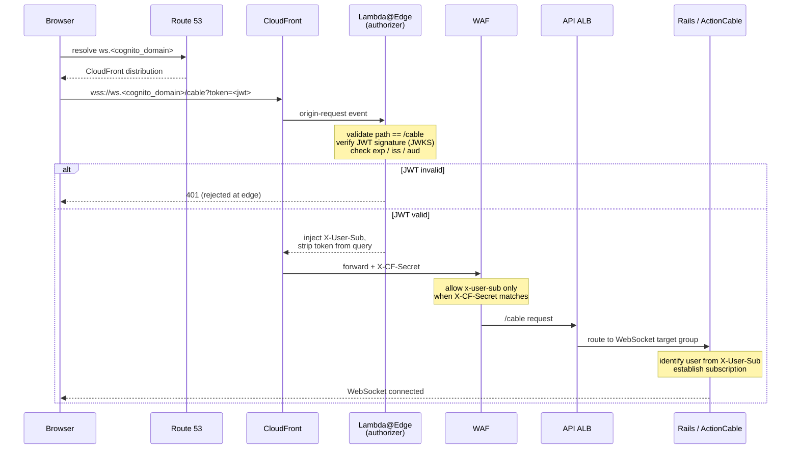

Real-time features are served over WebSockets by Rails **ActionCable**, mounted at `/cable`. Because ActionCable runs behind the public API load balancer, the connection can't be trusted on the strength of its origin alone. Instead, a chain of edge components authenticates the client's JWT **before** the request ever reaches the application, and hands ActionCable a single trusted identity header.

The design goal is that **Rails never validates the WebSocket token itself**. By the time a request arrives at ActionCable, its identity has already been proven at the edge and stamped into a header that only the edge is allowed to set.

## End-to-end flow

<Steps>
  <Step title="Client opens the socket">
    The browser connects to `wss://ws.<cognito_domain>/cable?token=<jwt>`, passing the user's Cognito JWT as a `token` query-string parameter. This hostname is a CloudFront distribution created specifically for WebSocket traffic.
  </Step>
  <Step title="DNS resolves to CloudFront">
    Route 53 points `ws.<cognito_domain>` at the CloudFront distribution (`aws_route53_record.websocket_cf`).
  </Step>
  <Step title="Lambda@Edge authorizes the request">
    On CloudFront's **origin-request** event, a Lambda@Edge authorizer validates the JWT. If validation fails, the request is rejected at the edge and never reaches the origin. On success it injects the trusted identity header and strips the token from the query string.
  </Step>
  <Step title="CloudFront forwards to the API ALB">
    CloudFront forwards the (now authenticated) request to the public API Application Load Balancer, adding a shared-secret header that proves the request came from CloudFront.
  </Step>
  <Step title="WAF enforces the trust boundary">
    A WAF on the public ALB blocks any externally-supplied identity headers, permitting the `x-user-sub` header only when the CloudFront shared secret is present.
  </Step>
  <Step title="ALB routes /cable to the WebSocket target group">
    A dedicated listener rule sends `/cable` to a WebSocket target group backed by the API ECS tasks.
  </Step>
  <Step title="ActionCable establishes the connection">
    Rails receives the upgrade request with a trusted `X-User-Sub` header, identifies the user from it, and establishes the subscription.
  </Step>
</Steps>

## Edge authorization (Lambda@Edge)

The authorizer runs on CloudFront's origin-request event and is the single point where the JWT is verified. It:

| Responsibility | Detail |
|---|---|
| **Restricts the path** | Only `/cable` is permitted; anything else is rejected. |
| **Reads the token** | Extracts the JWT from the `token` query-string parameter. |
| **Verifies the signature** | Validates the JWT signature against the Cognito **JWKS**. |
| **Validates the claims** | Checks `exp` (expiry), `iss` (issuer), and the audience. |
| **Stamps identity** | Injects `X-User-Sub` with the authenticated Cognito subject. |
| **Removes the token** | Strips `token` from the query string before forwarding, so the JWT is never logged or forwarded downstream. |

<Info>
Passing the JWT as a query-string parameter (rather than an `Authorization` header) is a deliberate accommodation for browser WebSocket clients, which cannot set custom headers on the handshake request. The Lambda@Edge authorizer compensates by removing the token immediately after validation.
</Info>

## The trust boundary

Two cooperating controls guarantee that a trusted `X-User-Sub` header can **only** originate from the edge authorizer, never from a client spoofing it.

<Steps>
  <Step title="CloudFront adds a shared secret">
    CloudFront attaches a shared-secret header (`X-CF-Secret`) to every origin request it sends to the ALB.
  </Step>
  <Step title="WAF rejects spoofed identity headers">
    The WAF on the public ALB blocks any inbound request that carries identity headers — `x-user-sub`, `x-client-id`, `x-user-jwt`, `x-user-username` — with a single exception: `x-user-sub` is allowed **only** when the matching `x-cf-secret` value is present.
  </Step>
</Steps>

The result: a request that reaches ActionCable with an `X-User-Sub` header must have passed through both the Lambda@Edge authorizer (which set the header) and CloudFront (which added the secret the WAF requires). A direct request to the ALB carrying a forged `x-user-sub` is dropped by the WAF because it lacks the secret.

<Warning>
The security of this scheme rests on the `X-CF-Secret` value staying secret to CloudFront and the WAF. If it leaked, an attacker could present a spoofed `x-user-sub` directly to the ALB and bypass edge authorization entirely.
</Warning>

## Rails / ActionCable side

Everything above happens before the request reaches the application. On the Rails side the connection logic is intentionally thin — it trusts the header the edge stamped. The ActionCable server is mounted at `/cable`, and the connection identifies the user from the injected header, which arrives in the Rack environment as `HTTP_X_USER_SUB`.

How the connection resolves a user:

| Behaviour | Detail |
|---|---|
| **Cognito is the primary path** | The connection reads the trusted `X-User-Sub` header and looks up the user by their Cognito subject (`cognito_sub`). This is the path the edge chain feeds. |
| **A legacy token path still exists** | For older clients that authenticate directly rather than through the Cognito/CloudFront chain, the connection falls back to matching an authentication token and email from the `token` parameter. New clients should use the Cognito path. |
| **Unauthorized connections are rejected** | If neither path resolves a user, the socket is closed with an unauthorized rejection. |
| **The token is scrubbed from notifications** | The `token` key is removed from ActionCable notification payloads so JWTs/auth tokens don't leak into instrumentation logs. |

### Origin checks and pub/sub

ActionCable applies its own allowed-origin check per environment (`config.action_cable.allowed_request_origins`):

| Environment | Allowed origins |
|---|---|
| Production | `https://*.clarus.ws` |
| Staging | `http(s)://*.clarussoftware.co.uk` |
| Mirror | `https://*.clarus-mirror.co.uk` |
| Development | `http(s)://*.lvh.me:<port>` |

Broadcasts are fanned out across API tasks through the **Redis** ActionCable adapter (`config/cable.yml`), so a message published on one ECS task reaches subscribers connected to any other.

## Reference: infrastructure sources

The edge and network components are defined in the infrastructure repository (`api/`):

| Component | Source |
|---|---|
| CloudFront distribution, DNS alias, Lambda@Edge association, shared secret | `api/websocket.tf` |
| Route 53 record for `ws.<cognito_domain>` (`aws_route53_record.websocket_cf`) | `api/websocket.tf` |
| Wildcard `*.api.<domain>` → ALB (origin resolution) | `api/modules/route53-api-domain/route53.tf` |
| Lambda@Edge authorizer implementation | `api/lambdas/websocket-authorizer/index.mjs` |
| WAF identity-header rules on the public ALB | `api/api-gateway.tf` |
| `/cable` listener rule → WebSocket target group (`aws_lb_listener_rule.api-websocket`) | `api/modules/lb-api/lb.tf` |

The application-side connection logic lives in the backend repository:

| Component | Source |
|---|---|
| ActionCable mount | `config/routes.rb` |
| Connection / user identification | `app/channels/application_cable/connection.rb` |
| Cognito sub header constant | `lib/devise/strategies/api_desktop.rb` |
| Redis pub/sub adapter | `config/cable.yml` |
| Allowed request origins | `config/environments/*.rb` |
